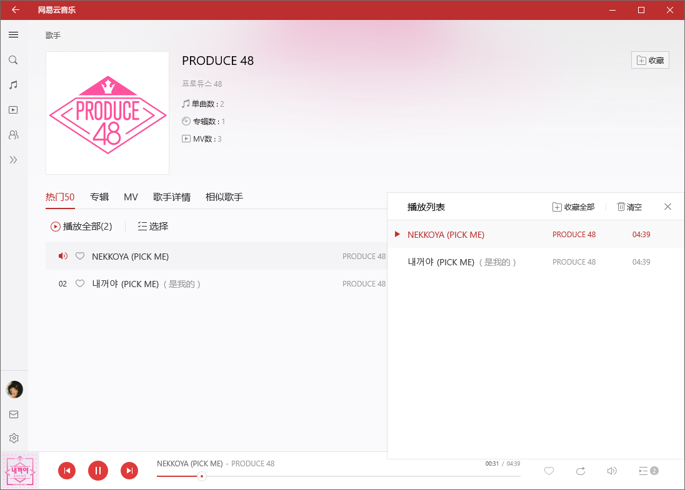

# UnblockNeteaseMusic

> 解锁网易云音乐客户端变灰歌曲

## 特性

- 使用QQ/虾米/~~酷狗/酷我~~音源替换变灰歌曲链接(因为质量问题未启用后两个)
- 为请求增加`X-Real-IP`参数解锁海外限制，支持指定网易云服务器IP，支持设置第二级HTTP/HTTPS代理
- 完整的流量代理功能(HTTP/HTTPS)，可直接作为系统代理(不过没有PAC)

## 使用

```
$ node app.js
```

### 配置参数

```
$ node app.js -h

  Usage: unblockneteasemusic [options] [value ...]

  Options:

    -V, --version            output the version number
    -p, --port <port>        specific server port
    -f, --force-host <host>  force the netease server ip
    -u, --proxy-url <url>    request through another proxy
    -h, --help               output usage information
```

### 支持客户端

> 支持Windows客户端，UWP客户端，Linux客户端和Mac客户端 ~~(不支持Mac客户端因为Mac上用的接口走HTTPS要MITM)~~(改hosts测试后可用，应该是Mac客户端请求HTTPS接口失败后自动降级到HTTP)

有如下两种方案

#### 1. 修改hosts
```
<Server IP> music.163.com
<Server IP> interface.music.163.com
```

> 修改hosts只能使用80端口 `-p 80` ，**若在本地运行，务必指定网易云服务器IP** `-f 223.252.199.66` (改hosts前自己ping一下)。因拦截HTTPS请求需自签根证书，暂时不处理

#### 2. 设置代理
Windows客户端设置内使用HTTP代理

UWP客户端下设置系统代理

> UWP应用需开启loopback才能走系统代理，可使用[Fiddler](https://www.telerik.com/fiddler)或[EnableLoopback Utility](https://github.com/tiagonmas/Windows-Loopback-Exemption-Manager)等工具

Linux客户端下设置环境代理

> 使用如下类似启动脚本
>
> ```
> node app.js -p <PORT> &
> export http_proxy=<127.0.0.1:PORT>
> bash netease-cloud-music &
> ```

Mac客户端下无法通过代理使用(默认接口走HTTPS，Tunnel未作拦截)

## 效果



## 感谢

感谢大佬们为逆向eapi所做的努力

使用的其它平台音源API出自

[listen1/listen1_chrome_extension](https://github.com/listen1/listen1_chrome_extension)

向所有同类产品致敬

[EraserKing/CloudMusicGear](https://github.com/EraserKing/CloudMusicGear)

[EraserKing/Unblock163MusicClient](https://github.com/EraserKing/Unblock163MusicClient)

[ITJesse/UnblockNeteaseMusic](https://github.com/ITJesse/UnblockNeteaseMusic/)

[bin456789/Unblock163MusicClient-Xposed](https://github.com/bin456789/Unblock163MusicClient-Xposed)

[yi-ji/NeteaseMusicAbroad](https://github.com/yi-ji/NeteaseMusicAbroad)

[stomakun/NeteaseReverseLadder](https://github.com/stomakun/NeteaseReverseLadder/)

[LesterLyu/NeteaseReverseLadder](https://github.com/LesterLyu/NeteaseReverseLadder)

## License

MIT