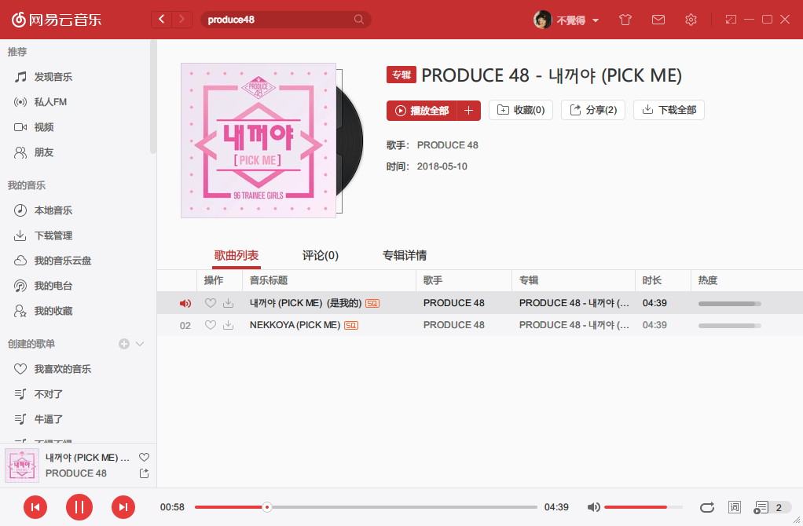
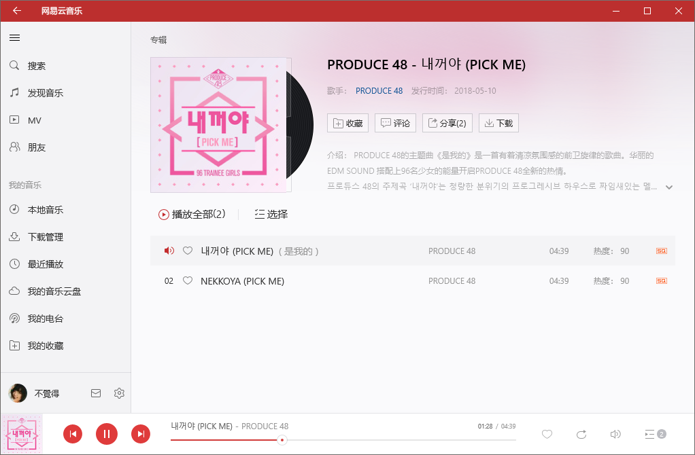
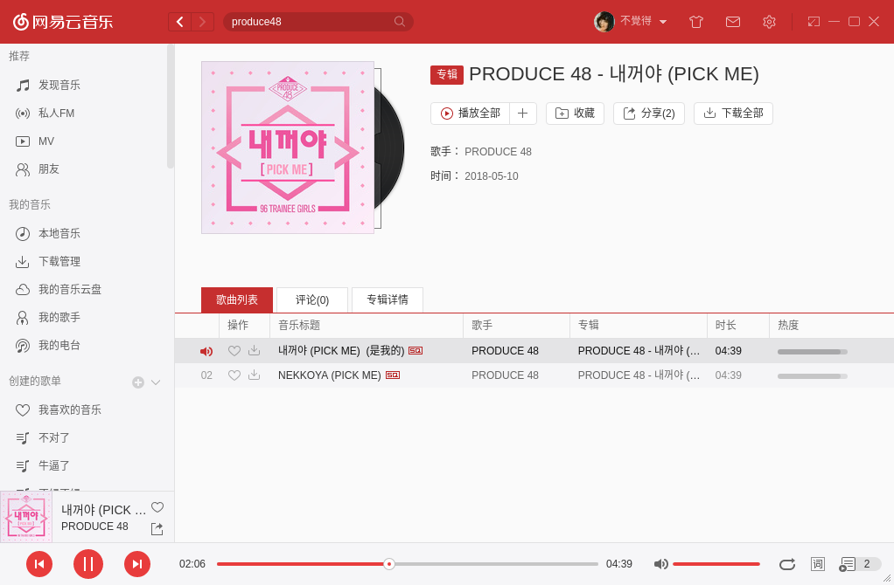
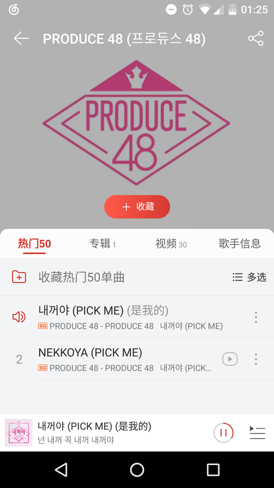

# UnblockNeteaseMusic

> 解锁网易云音乐客户端变灰歌曲

## 特性

- 使用QQ/虾米/百度/~~酷狗/酷我/咕咪~~音源替换变灰歌曲链接(因为质量问题部分未启用)
- 为请求增加`X-Real-IP`参数解锁海外限制，支持指定网易云服务器IP，支持设置第二级HTTP/HTTPS代理
- 完整的流量代理功能(HTTP/HTTPS)，可直接作为系统代理(支持PAC)

## 运行

```
$ node app.js
```

### 配置参数

```
$ node app.js -h

  Usage: unblockneteasemusic [options] [value ...]

  Options:

    -V, --version            output the version number
    -p, --port <port>        specific server port
    -f, --force-host <host>  force the netease server ip
    -u, --proxy-url <url>    request through another proxy
    -h, --help               output usage information
```

### 使用

> 支持Windows客户端，UWP客户端，Linux客户端，Mac客户端和Android客户端 (Mac客户端和Android客户端默认请求HTTPS接口，代理后端对网易云的HTTPS接口连接都返回空数据，迫使客户端自动降级使用HTTP接口)
>
> 不支持iOS客户端，因为Apple强制要求使用HTTPS所以无法降级，要支持只能自签证书做MITM了
>
> 解锁的变灰歌曲能试听但是无法下载，很无奈，测试下载发现网易云会提示下载失败，个人猜测应该是下载完后写ID3标记时出错了，因为其他平台的歌源大多都不是MP3格式的。

有如下两种方案

#### 1. 修改hosts
```
<Server IP> music.163.com
<Server IP> interface.music.163.com
```

> 通过修改hosts使用必需是80端口 `-p 80` ，**若在本地运行，请务必指定网易云服务器IP** `-f 223.252.199.66` (改hosts前自己ping一下)。
>
> **Android客户端下修改hosts无法使用**，原因和解决方法详见[云音乐安卓又搞事啦](https://jixun.moe/post/netease-android-hosts-bypass/)，[安卓免 root 绕过网易云音乐 IP 限制](https://jixun.moe/post/android-block-netease-without-root/)

#### 2. 设置代理

>  PAC自动代理 `http://<Server IP:PORT>/proxy.pac`

Windows客户端设置内选择使用HTTP代理

UWP客户端下设置系统代理

> UWP应用需开启loopback才会走系统代理，可使用[Fiddler](https://www.telerik.com/fiddler)或[EnableLoopback Utility](https://github.com/tiagonmas/Windows-Loopback-Exemption-Manager)等工具

Linux客户端下设置HTTP/HTTPS/自动代理

> 命令行下可以使用类似的启动脚本
>
> ```
> node app.js -p <PORT> &
> export http_proxy=<127.0.0.1:PORT>
> bash netease-cloud-music &
> ```
> 

Android客户端下设置HTTP代理

Mac客户端下设置HTTP/HTTPS/自动代理

> 系统偏好设置>网络>高级>代理

## 效果

#### Windows客户端



#### UWP客户端



#### Linux客户端



#### Mac客户端


#### Android客户端



## 感谢

感谢大佬们为逆向eapi所做的努力

使用的其它平台音源API出自

[trazyn/ieaseMusic](https://github.com/trazyn/ieaseMusic)

[listen1/listen1_chrome_extension](https://github.com/listen1/listen1_chrome_extension)

向所有同类产品致敬

[EraserKing/CloudMusicGear](https://github.com/EraserKing/CloudMusicGear)

[EraserKing/Unblock163MusicClient](https://github.com/EraserKing/Unblock163MusicClient)

[ITJesse/UnblockNeteaseMusic](https://github.com/ITJesse/UnblockNeteaseMusic/)

[bin456789/Unblock163MusicClient-Xposed](https://github.com/bin456789/Unblock163MusicClient-Xposed)

[yi-ji/NeteaseMusicAbroad](https://github.com/yi-ji/NeteaseMusicAbroad)

[stomakun/NeteaseReverseLadder](https://github.com/stomakun/NeteaseReverseLadder/)

[LesterLyu/NeteaseReverseLadder](https://github.com/LesterLyu/NeteaseReverseLadder)

## License

MIT